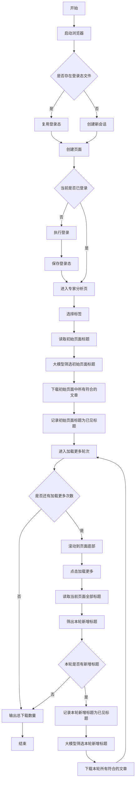

# Playwright 信息收集项目

该项目用于自动化登录并访问 Mintel 页面，辅助信息收集与文章下载。

## 快速开始
### 1. 安装依赖

```powershell
pip install -r requirements.txt
python -m playwright install chromium
```

### 2. 配置账号（Keyring）
在运行 `main.py` 或 `main2.py` 之前，需要先把账号密码和 DeepSeek 配置写入系统凭据库。
可使用 `info.py`（请先把占位符改成真实信息）：

```python
import keyring

keyring.set_password("mintel", "username", "你的邮箱")
keyring.set_password("mintel", "password", "你的密码")
keyring.set_password("deepseek", "api_key", "你的DeepSeek API Key")
keyring.set_password("deepseek", "model", "deepseek-chat")
```

执行：

```powershell
python info.py
```

### 3. 运行主程序

```powershell
python main.py
python main2.py
```

## 运行产物

- `auth.json`：登录态缓存文件，下次可直接复用登录态
- `test.html`：页面 HTML 快照
- `*.pdf`：下载到项目根目录下的文章 PDF

## main2 当前流程

- 复用 `auth.json`，失效时重新登录
- 进入“专家分析”页面并选择标签
- 先对初始页面已出现的卡片做一次标题筛选
- 然后最多执行 3 轮“加载更多”查找
- 每一轮只评估这一轮新增出来的标题
- 下载每一轮中所有符合用户意图的文章
- 不重复评估旧标题，也不重复下载同一标题



## 常见问题

- 报错 `please save mintel username/password in keyring first`
  先执行 `python info.py`，确认已经写入 Mintel 账号密码。
- 报错 `please save deepseek api_key in keyring first`
  先执行 `python info.py`，确认已经写入 DeepSeek API Key。
- 登录态失效
  删除 `auth.json` 后重新运行 `python main.py` 或 `python main2.py` 即可重新登录。
