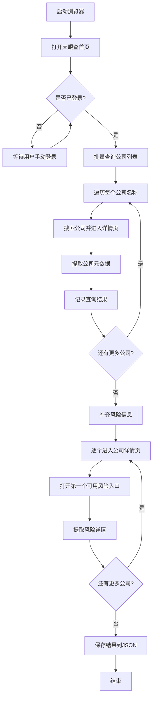

# 天眼查自动化查询模块 (tyc)

本模块用于自动化查询天眼查网站上的公司信息，支持批量查询公司元数据和风险信息。

## 功能概述

- **批量公司查询**: 按顺序逐个查询目标公司列表
- **公司元数据提取**: 提取公司详情页的基本信息（名称、状态、标签、简介等）
- **风险信息收集**: 自动进入风险详情页，采集公司风险数据
- **登录状态管理**: 检测登录状态，支持等待用户手动登录
- **页面状态监控**: 检测登录弹窗和身份验证页，提示用户处理

## 目录结构

```
tyc/
├── main.py                          # 主入口，批量查询流程
├── modules/                         # 核心功能模块
│   ├── batch_company_query.py       # 批量公司查询
│   ├── browser_context.py           # 浏览器上下文配置
│   ├── enter_company_detail_page.py # 进入公司详情页
│   ├── login_state.py               # 登录状态检测
│   ├── page_guard.py                # 页面状态检测总入口
│   ├── run_step.py                  # 步骤执行封装
│   ├── wait_for_recovery.py         # 等待恢复工具
│   ├── company_metadata/            # 公司元数据提取
│   │   └── extractor.py
│   ├── company_risk/                # 公司风险信息采集
│   │   ├── collector.py             # 风险收集主入口
│   │   ├── models.py                # 数据模型定义
│   │   ├── navigator.py             # 风险页面导航
│   │   └── page_extractor.py        # 风险页面内容提取
│   └── guards/                      # 页面状态检测
│       ├── login_modal.py           # 登录弹窗检测
│       └── verification_page.py     # 身份验证页检测
├── tests/                           # 单元测试
├── company_text.json                # 查询结果输出文件
└── note.md                          # 开发笔记（验证码模块设计）
```

## 使用方法

### 1. 配置目标公司

编辑 `main.py` 中的 `TARGET_COMPANY_NAMES` 列表：

```python
TARGET_COMPANY_NAMES = [
    "小米通讯技术有限公司",
    "抖音有限公司",
    # 添加更多公司名称...
]
```

### 2. 运行程序

```powershell
python tyc/main.py
```

### 3. 查看结果

查询结果保存在 `tyc/company_text.json` 文件中。

## 主流程说明



## 核心模块说明

### 批量查询模块 (`batch_company_query.py`)

- 按顺序逐个查询公司
- 支持错误继续或停止
- 每次查询后返回首页，降低页面状态污染

### 公司元数据提取 (`company_metadata/extractor.py`)

提取以下信息：
- 公司名称、经营状态
- 公司标签
- 详细信息项（注册资本、法定代表人等）
- 公司简介
- 完整文本内容

### 风险信息收集 (`company_risk/`)

按优先级顺序选择风险入口：
1. 自身风险
2. 周边风险
3. 历史风险
4. 预警提醒

### 登录状态检测 (`login_state.py`)

- 自动检测当前登录状态
- 未登录时阻塞等待用户手动完成登录
- 每3秒自动复查登录状态

### 页面状态监控 (`guards/`)

检测并提示以下异常页面：
- **登录弹窗**: 检测中途弹出的登录界面
- **身份验证页**: 检测验证码页面

## 输出数据结构

```json
[
  {
    "company_name": "公司名称",
    "success": true,
    "data": {
      "company_name": "公司名称",
      "company_status": "存续",
      "company_tags": ["标签1", "标签2"],
      "detail_items": {
        "注册资本": "1000万",
        "法定代表人": "张三"
      },
      "introduction": "公司简介...",
      "full_text": "完整文本..."
    },
    "risk_data": {
      "selected_risk_type": "自身风险",
      "selected_risk_count": 5,
      "risk_details": [...]
    },
    "error": ""
  }
]
```

## 注意事项

1. **登录要求**: 首次运行需要手动完成登录，程序会等待登录完成后继续执行
2. **验证码处理**: 遇到验证码时需要手动完成验证
3. **请求频率**: 程序已内置等待机制，避免请求过于频繁
4. **浏览器持久化**: 使用持久化浏览器上下文，登录态可复用
