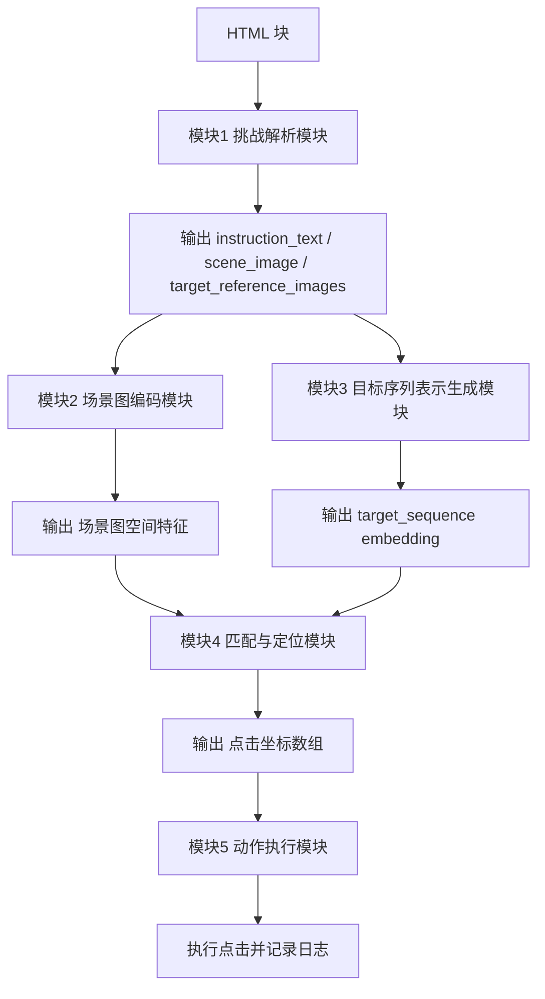

## 一、模块划分（当前定稿版）

### 🟦 模块1：挑战解析模块

**输入：**

- HTML 块

**输出：**

```json
{
  "instruction_text": "...", // 挑战要求 字符串
  "scene_image": "...", // 图片路径/图片二进制 字符串
  "target_reference_images": [] // 目标的图片路径/图片二进制 字符串数组
}
```

**作用：**

- 提取提示词
- 提取主图片（验证码图）
- 提取“目标样本区域”（如果有）

### 🟩 模块2：场景图编码模块（视觉）

**输入：**

- `scene_image` 图片路径/二进制 字符串

**输出：**
嵌入向量
```text
[
  (位置1, embedding1),
  (位置2, embedding2),
  ...
]
```
*note*:这里的原理是将图片切分成若干块,每一块位置给一个embedding值.
**作用：**

- 把图片转换为“空间特征表示”（用于定位）

### 🟨 模块3：目标序列表示生成模块（多模态）

**输入：**

- `instruction_text`
- `target_reference_images`（可选）

**输出：**

```json
{
  "task_type": "ordered_click",
  "target_sequence": [
    { "embedding": [...] },
    { "embedding": [...] }
  ]
}
```

**作用：**

- 把“要点击的目标”统一转成 `embedding`（支持文字/图案）

### 🟥 模块4：匹配与定位模块（核心）

**输入：**

- 场景图空间特征
- `target_sequence`（`embedding`）

**逻辑：**

```python
for each_target in target_sequence:
    # 在所有图像位置中找到最相似的 embedding
    ...
```

**输出：**

```json
{
  "points": [[x1, y1], [x2, y2], [x3, y3]]
}
```

**作用：**

- 按顺序输出与 `target_sequence` 一致的定位结果

### 🟪 模块5：动作执行模块

**输入：**

- 坐标数组

**输出：**

- 执行日志

**作用：**

- 执行点击（可先做模拟或打印）


## 二、完整流程（主链路）

### 流程说明

**Step 1：HTML 输入到模块1**

- 输入：HTML 块
- 处理：挑战解析模块
- 输出：`instruction_text`、`scene_image`、`target_reference_images`

**Step 2：场景图输入到模块2**

- 输入：`scene_image`
- 处理：场景图编码模块
- 输出：场景图空间特征

**Step 3：提示词和参考图输入到模块3**

- 输入：`instruction_text`、`target_reference_images`
- 处理：目标序列表示生成模块
- 输出：`target_sequence`（embedding）

**Step 4：模块2和模块3结果输入到模块4**

- 输入：场景图空间特征、`target_sequence`
- 处理：匹配与定位模块
- 输出：点击坐标数组

**Step 5：坐标输入到模块5**

- 输入：点击坐标数组
- 处理：动作执行模块
- 输出：执行点击与执行日志

### Mermaid 代码


