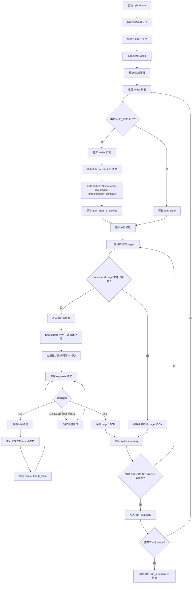

可以是可以，但是我接下来要做的事情是:
1.实现自动向下滑动表格，直到表格无法被滑动到最下方为止（这个表格是，滑动以后动态加载数据。
2.使用playwright自动化获取其中单页内容
3.将单页内容自动存储（不是覆盖，是添加。将最新获取到的单页数据添加在指定文件中）
4.自动翻页，然后再次执行上述的1,2,3阶段

接下来确认三件事情,第一件事是,我所需要的表格数据你是否能全部看到?我需要的数据就是mid2.md中的内容
第二件事，你是否能看到表格的滚动条？这个不是整个页面的滚动条哦，是专门给那个表格配的
第三件事，你是否能看到翻页按钮在哪？或者下次我直接用网址好了，比较稳。但是使用网址的话，你是否能知道如何判断一个页面的表格是否有元素（如果页面超了，也就是当前页面没有检测到元素，就需要直接退出循环）

接下来做一件事:
将创建浏览器上下文,zhy初始化页面和zhy表格抓取三件事合并成一步为一个总流程文件.编码风格遵循MODULE_GENERATION_GUIDE.md

好的,你可以总结一下,你使用的playwright定位方式包括哪些?本人不是很喜欢用class匹配,虽然这个网站的class属性看起来比较友好(就是似乎没有一堆程序生成的class名)

我现在要筛选出最近一年的所有专利(日期指定公开日期。如果没有公开日期，那么就指定第一个带有“日期”，“时间”等字样的字段值)，然后提取出来所有的公开号。存储在一个文件中。
以上模块需要加到现有的流程zhy\tasks\folder_table_probe_task.py。可能需要一些新的模块？想加就加。

然后建立一个全新的json文件，用来存储已经下载PDF的专利公开号。
在专门的页面接口自动化下载专利PDF,每天允许下载n份.这个接口地址是https://analytics.zhihuiya.com/search/input/bulk,源码在mid4.html其中有一个输入框可以输入专利号，只需要用换行符分割专利公开号就行。点击查询（导出？）按钮以后会进入类似https://analytics.zhihuiya.com/export?_type=batch&sort=sdesc&sn=14238f59-1696-431f-beab-7b057c01def8&q=%5BBULK%5D14238f59-1696-431f-beab-7b057c01def8#/的地址,是具体的导出页面.点击导出按钮即可.页面源码在mid5.html
你先看看上述逻辑,以目前的信息来看,是否足够?

目前的代码zhy\tasks\folder_table_probe_task.py
看起来完全是没问题的,就目前为止,爬取数据应该就是没什么问题了看起来.
接下来修改一下代码逻辑。
1.不要每个页面单独输出一个,目录.将同一个文件夹下的内容放在同一个目录下
2.现在需要支持多个文件夹信息一口气爬取,但是文件夹执行顺序是串行而不是并发.
3.接下来我要重新整理这一块的代码.太乱了.你先说说当前zhy\tasks\folder_table_probe_task.py没有遵循MODULE_GENERATION_GUIDE.md中的哪几条？

我发现你目前的zhy项目，没有使用到run_step_async之类的每步都低函数?现在必须立刻加上.只需要给zhy\tasks\folder_table_probe_task.py加上就行,其他的流程文件暂时不管.
run_step_async函数目前的功能就是给每一步兜底.对于playWright的直接API函数,重试3次即可;但是对于模块级的函数,比如说zhy\utils\zhy\zhy_table.py中的zhy_table,重试次数可以少一点.总之层级越高重试次数越少.
这个run_step_async实现逻辑可以参考tyc项目的同名函数.但是zhy的这个函数暂时先不做页面检查(就是检查当前页面是不是验证页面等)

我发现当前的日期筛选太过死板,只能筛选出最近一年的专利.我期望这个筛选模块的调用单独提出来,被一个新的流程文件调用,然后改造原模块为,传入两个日期,第一个日期一定早于第二个日期,然后筛选出公开日期在两个日期之间的专利.zhy\tasks\folder_table_probe_task.py中的关于筛选专利的代码先去掉.

